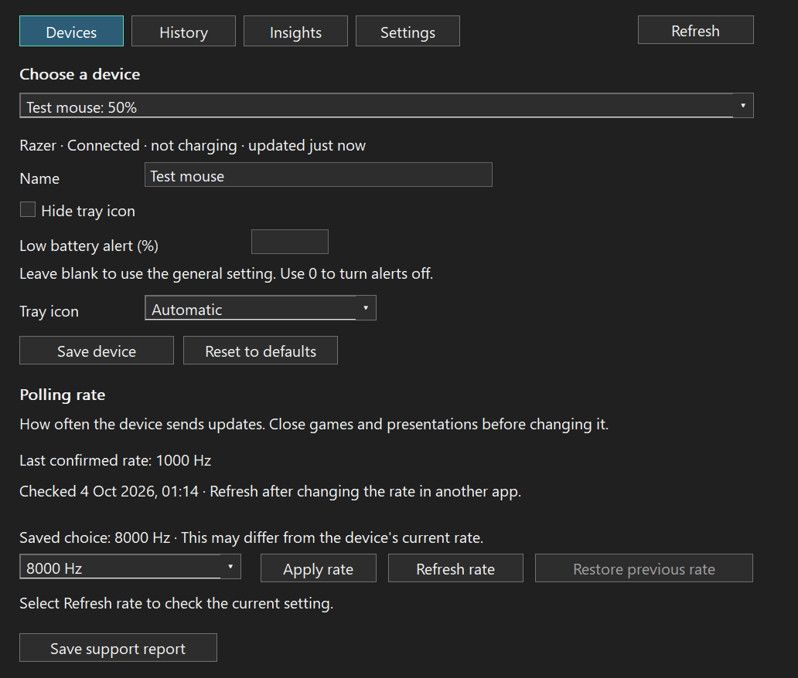
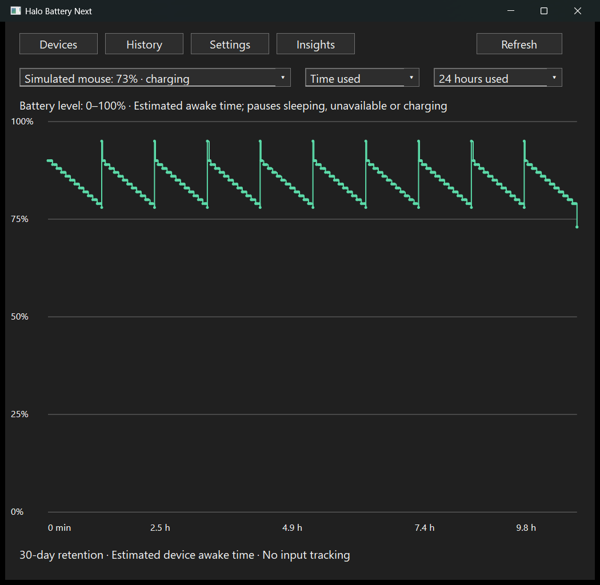
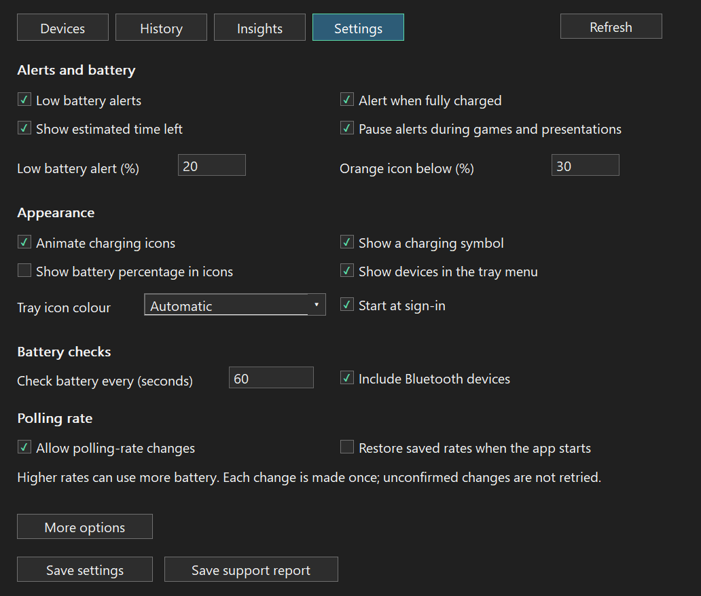
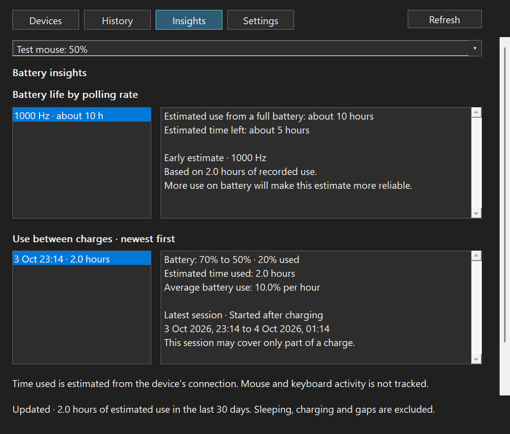

# Halo Battery Next

A lightweight Windows 11 x64 battery monitor and device configuration app, written
in Rust with native Win32 controls and Direct2D graphics. Each battery device gets
its own system-tray icon. One portable executable runs without Python, .NET or a
webview runtime.

This is an independent rewrite of [HaloBattery](https://github.com/HeyOkay/HaloBattery),
based on upstream 1.13.0 (`a566a046`). It carries forward device protocols, provider
behavior, tests and hardware reports through a separately implemented runtime.
The source tree contains the Rust app and its development tools; the original
Python application is maintained externally as a reference.

## Features

- **Devices, History, Insights and Settings:** native dashboard, keyboard navigation,
  per-monitor DPI, automatic Windows app light/dark appearance and themed tray menus.
  Grouped Settings and scrollable pages keep navigation and the Settings Save
  footer visible. More options holds less-used settings; device labels, polling
  feedback and battery-life summaries use plain language.
- **25 battery provider families:** mice, wireless keyboards, headsets and controllers
  over HID, Bluetooth, XInput and Windows.Gaming.Input. Per-device rename, hide,
  icon selection, alert thresholds and provider switches.
- **Thirty-day history:** Time used is the default view; sleeping and unavailable
  periods pause estimated awake time. Calendar views carry the last known level
  through missing readings. Original observations remain intact.
- **Battery insights:** conservative remaining-use predictions, observed charge
  summaries and drain comparisons by hardware-confirmed polling rate, with evidence
  coverage and freshness. Awake time measures availability rather than input activity.
- **Optional polling controls:** read, apply and restore for allowlisted Razer,
  Logitech and MCHOSE mice and five wired Razer keyboards. Supported mouse tray
  menus select a rate directly; tooltips retain the last confirmed rate without
  querying on hover. Optional startup restore applies saved selections once.
  With controls enabled, a one-time startup read fills mouse tooltips without
  opening the dashboard; sleeping or inaccessible devices may need Refresh later.
- **Batteryless keyboards:** appear on Devices without battery tray icons, alerts,
  history or estimates. Recognized Corsair models, including K70 RGB Pro, explain
  why polling changes are unavailable under the one-time-only configuration policy.
- **Battery warnings:** configurable orange band at 30% by default, then red at the
  low-alert threshold. Charging animation, full-charge alerts and gaming suppression.
- **Stable monitoring:** tray placement persists through mouse sleep; closing the
  dashboard leaves monitoring active. Connection events, bounded workers, cached
  graphics and batched history keep background work small.

See [supported battery devices](docs/device-support.md),
[polling models and limits](docs/polling-controls.md) and the
[application guide](docs/application.md). DeathAdder V4 Pro wireless polling is
**hardware verified by user testing** at all six supported rates: 125, 500, 1000,
2000, 4000 and 8000 Hz. Parent-app battery verification is labelled separately;
it does not establish polling verification.

Polling controls default off and use ordinary user-mode HID access: no drivers,
elevation, game-process access, input interception or continuous rate enforcement.
These boundaries do not claim universal anti-cheat approval.

## Screenshots

Native UI with **synthetic device and history data**. Devices, Settings and
Insights show the 4 October 2026 dashboard refinement using native test renders;
History is from the 2 October release capture. Screenshots demonstrate the
interface, not hardware verification.

| Devices | History |
| --- | --- |
|  |  |

| Settings | Insights |
| --- | --- |
|  |  |

[Light Devices](docs/screenshots/devices-light.png) ·
[Light Settings](docs/screenshots/settings-light.png) ·
[Capture instructions](docs/screenshots/README.md)

## Performance compared with the original

The [3 October audit](docs/performance-audit-20261003.md) addresses access-failure
retry loops, bounded history recovery, departed-device caches and History resizing.
The [4 October UI audit](docs/ui-audit-20261004.md) records the dashboard changes,
native resource checks and their limits.

Local Windows measurements used **three-minute windows**, a 60-second battery
refresh interval and status export enabled, with dashboards and menus closed.
Original figures include observed helper processes. These are historical audit
checkpoints, not new measurements of every subsequent build.

| Measurement | Original Halo Battery 1.13.0 | Rust port 0.1.0 |
| --- | ---: | ---: |
| Wireless DeathAdder V4 Pro: average private memory | 138.18 MiB | 6.03 MiB |
| Wireless DeathAdder V4 Pro: CPU, one logical core | 0.269% | 0.122% |
| Simulated animated charging mouse: average private memory | 33.10 MiB | 5.66 MiB |
| Simulated animated charging mouse: CPU, one logical core | 0.226% | 0.156% |
| Executable size at optimization checkpoint | Not measured | 2.64 MiB |

The native runtime and cached graphics substantially reduced memory on the tested
machine while adding history and a dashboard. These compare unchanged upstream
Python source with optimized Rust builds, rather than two packaged releases.
The Rust hardware run includes mouse sleep, so its CPU figure is not a
like-for-like speedup comparison. See the [performance audit](docs/performance-audit-20261002.md)
and [original resource audit](docs/resource-audit.md) for workloads, compiler
experiments, exact builds and limitations.

## Build and run

Install Rust stable with the MSVC toolchain, Visual Studio C++ build tools and the
Windows SDK. Run from this repository root:

```powershell
cargo fmt --all --check
cargo clippy --workspace --all-targets --locked -- -D warnings
cargo test --workspace --locked
.\tools\build-rust.ps1
.\tools\package-rust.ps1
```

The portable output is `dist/HaloBatteryNext-0.1.0-windows-x64/` and its ZIP beside
it. Run `HaloBatteryNext.exe` to open the dashboard; `--background` starts quiet
monitoring. Close the window to keep monitoring, reopen from a tray icon or by
launching the executable again, and use tray **Exit** to stop it.

Settings, SQLite history, diagnostics and optional status export live under
`%APPDATA%\HaloBatteryNext`. Startup registration uses `--background`. The app has
separate settings and notification identity from the parent application.
Update checking is disabled until an independent release repository is configured.

The portable executable statically links HIDAPI, SQLite and the MSVC CRT. Build
scripts optimize for size and strip local compiler paths. Builds and validation
run locally; GitHub workflows remain disabled for this fork.

## Development and device updates

| Path | Purpose |
| --- | --- |
| `crates/core` | Platform-independent models, settings, alerts and estimates |
| `crates/providers` | Device catalogs, protocols and injected transport tests |
| `crates/windows` | Native HID, Bluetooth, controller and Windows integration |
| `crates/storage` | Atomic configuration and bounded SQLite history |
| `crates/app` | Native UI, tray and bounded application workers |
| `tools` | Rust build, package, validation and external-reference generators |
| `docs` | Support tables, protocol credits, evidence and screenshots |

Python is needed only for selected development tools. Generators accept an
external reference through `--upstream PATH` or `HALO_BATTERY_UPSTREAM`; ordinary
Rust builds and coverage checks use committed catalogs and fixtures. Future
upstream product changes require a reviewed port, not recompilation alone.
See [contributing](CONTRIBUTING.md), [provider parity](docs/provider-parity.md),
[release steps](docs/releasing.md) and the [changelog](CHANGELOG.md).

## Credits and license

Thank you to [HeyOkay](https://github.com/HeyOkay) and the
[original HaloBattery contributors](https://github.com/HeyOkay/HaloBattery/graphs/contributors)
for the application, protocol research, tests, diagnostics and hardware reports.
Upstream's [MIT license](LICENSE) is retained. Protocol sources and their
contributors remain credited in [protocol notes](docs/protocols.md) and the
polling evidence documents. Portable packages include dependency notices.
