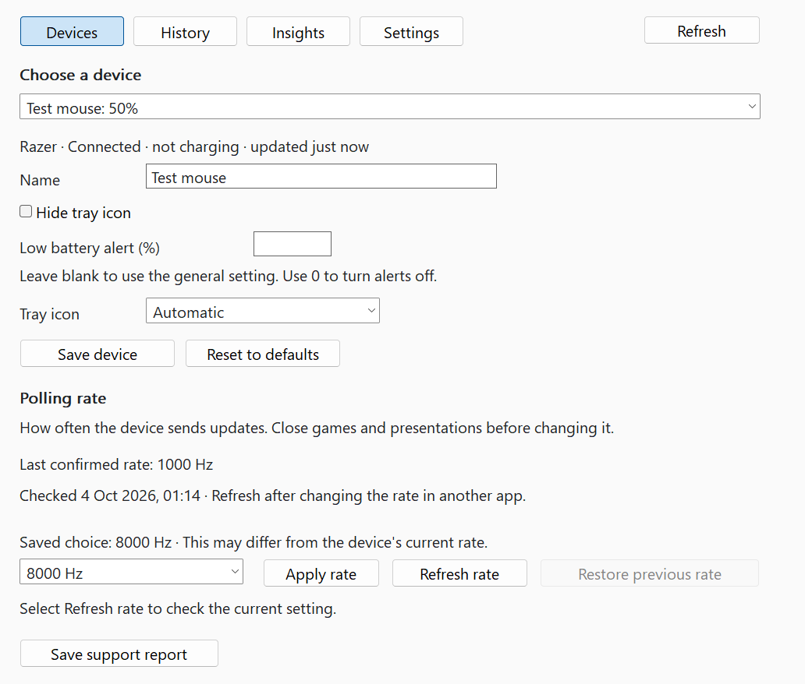
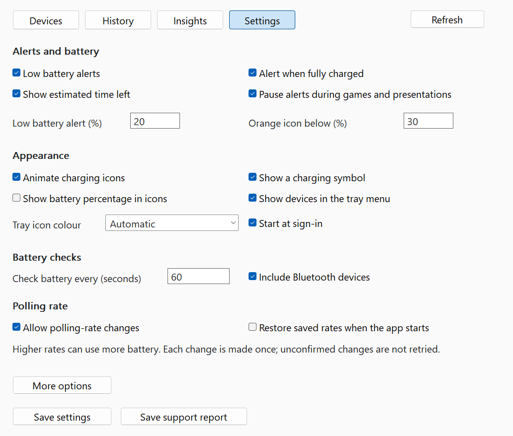

# Halo Battery Next 0.1.0

DeathAdder V4 Pro wireless polling: **hardware verified by user testing** at all
supported rates (125, 500, 1000, 2000, 4000 and 8000 Hz), confirmed 2 October 2026.
Battery devices verified upstream are labelled **User-verified in parent app** in the
[device support table](device-support.md); this does not imply polling-rate verification.

A standalone Windows 11 x64 Rust/Win32 rewrite of [HaloBattery](https://github.com/HeyOkay/HaloBattery), based on upstream 1.13.0 (`a566a046`). The Rust workspace is at the repository root, with `crates/`, `docs/`, `tools/` and `Cargo.toml`. It inherits the parent app's device protocols, provider behavior, tests and hardware reports through a separately implemented native runtime. The original Python application is an external reference, not a runtime dependency or part of this source tree.

Thanks to [HeyOkay](https://github.com/HeyOkay) and all
[original HaloBattery contributors](https://github.com/HeyOkay/HaloBattery/graphs/contributors)
for the original application, protocol research, tests and hardware reports.
The port retains upstream MIT notices and credits to the device-protocol projects.

## Performance compared with upstream

Three-minute Windows measurements, with 60-second battery polling, status export
enabled and dashboards/menus closed:

| Measurement | Original Halo Battery 1.13.0 | Rust port 0.1.0 |
| --- | ---: | ---: |
| Wireless DeathAdder V4 Pro: average private memory | 138.18 MiB | 6.03 MiB |
| Wireless DeathAdder V4 Pro: CPU, one logical core | 0.269% | 0.122% |
| One simulated charging mouse: average private memory | 33.10 MiB | 5.66 MiB |
| One simulated charging mouse: CPU, one logical core | 0.226% | 0.156% |
| Portable executable size | Not measured | 2.64 MiB |

Original figures include observed helper processes. This is unchanged upstream
Python source versus optimized Rust release builds on one machine; a packaged
original release was unavailable. Original figures are retained from the previous
audit. Rust figures use the 2 October optimization build and 40 animated dashboard
warmup cycles. Its hardware run includes mouse sleep, so the CPU figures are not
a like-for-like speedup comparison. The controlled animated before/after run used
about 12% less private memory with unchanged CPU. The fork retains 30-day raw
history and a native dashboard. See the [latest performance audit](performance-audit-20261002.md)
for allocation savings, exact builds and limitations, and the [original resource
audit](resource-audit.md) for Python conditions and compiler experiments.

## Run and build

Run `HaloBatteryNext.exe` to open the dashboard. Closing the window keeps monitoring active. Click a device tray icon, choose Open app, or launch the executable again to reopen it. A duplicate `--background` launch stays quiet. The tray menu offers refresh, device settings and Exit. Settings include Windows startup registration, which starts the executable with `--background`.

The dashboard follows Windows app light/dark appearance and changes while open,
including native controls, history graphics and the tray context menu. Windows high-contrast colors
take priority. Tray appearance remains independently configurable. Unplugged
or hidden devices still follow the existing per-device tray identity rules.

Devices, Settings and Insights scroll when their content exceeds the available
height; navigation stays visible above the page. Settings keeps **Save settings**,
**Save support report** and feedback in a fixed footer. Its options are grouped
under Alerts and battery, Appearance, Battery checks and Polling rate.
**More options** reveals device brands, status export, optional extra PlayStation checks
and the update source; update checks remain unavailable in this version.

Device details describe connection and charging states in plain language. Tray
icon choices include Controller, PlayStation 4 and PlayStation 5; colour choices
include Automatic, White, Black, Windows style and Top bar. The battery check
interval is labelled in seconds. Invalid values show a correction message while
keeping the current edits available, rather than rebuilding the form.

Devices shows **Last confirmed rate** separately from **Saved choice**: a saved
choice may differ from the device's current setting. Check times and dates for
use between charges use the computer's local time. Refresh the rate after changing it
in another app. Sleeping or unavailable battery readings are labelled **last
known**; missing levels are shown as **battery level unavailable**.

**Save support report** writes `diagnostics.json` in the app's data folder and
shows a plain-language result. The report retains technical provider, polling
and Insights details for troubleshooting; it is saved locally, not sent anywhere.

Supported mouse tray icons also offer **Polling rate → desired rate**. Enable
polling controls once in Settings; no preliminary Refresh is needed. The worker
reads and validates the hardware before changing it, then verifies readback.
Opening the submenu performs no hardware I/O. Last-confirmed checkmarks, optional
Refresh and Restore previous are available; the submenu shares the system theme.
With polling controls enabled, supported online mice get one guarded rate read
during the first 60 seconds after launch, including background launch. Tooltips
therefore fill without opening a dashboard or flyout. Saved startup restoration
supplies its own readback; its request waits for local worker capacity. No recurring
rate queries are added, and sleeping or inaccessible devices may need Refresh later.

Noncharging battery rings turn orange at **30%** by default, then red at the
device's configured low-alert threshold (20% by default). Charging remains green.
Settings → Orange icon below (%) adjusts the visual band; zero disables orange.
Red takes priority if thresholds overlap. Notification thresholds are unchanged.

Configuration, diagnostics, optional `status.json` and SQLite history are stored in `%APPDATA%\HaloBatteryNext`. The app has its own startup entry, singleton mutex and notification identity. It does not import upstream settings. Both applications may run together, but receivers that reject concurrent access report recoverable errors.

Build with Rust and the Visual Studio C++/Windows SDK tools:

```powershell
cargo fmt --all --check
cargo clippy --workspace --all-targets --locked -- -D warnings
cargo test --workspace --locked
.\tools\build-rust.ps1
.\tools\package-rust.ps1
```

The portable executable statically links HIDAPI's Windows C backend, bundled SQLite and the MSVC CRT. Native Windows system components provide Win32/WinRT/Direct2D. No Python, .NET, webview or asynchronous runtime is needed by the executable.

The release script also removes local build paths from embedded compiler messages.

## Architecture

| Crate | Responsibility |
| --- | --- |
| `hb-core` | Device readings, validated settings, identity precedence, alerts and awake-use estimates; no Windows or UI dependencies |
| `hb-providers` | Vendor protocols and parsers with injected HID and clock contracts |
| `hb-windows` | HID, Bluetooth, WGI/XInput, native resources, startup, theme and gaming detection |
| `hb-storage` | Atomic JSON and bounded, batched SQLite history |
| `halo-battery-next` | One state owner, two HID workers, one WinRT worker, one storage worker and one native UI thread |

Providers return either successful discovery (possibly empty) or an explicit communication error. Errors retain stale device readings instead of treating failures as disconnects. Immutable snapshots cross to the UI; commands cross back to the engine. Queues and worker counts are bounded. Charging HICON frames are cached; the 100 ms timer runs only while an animated charging icon exists. Dashboard graphics are created on demand and released on close. Calendar history selects the requested interval; use-time history streams retained observations to calculate awake time before bounded display sampling.

The grouped layout and scrolling use native Windows controls without a new
dependency, UI framework or background graphics. Dashboard body and heading
fonts are reused at the current DPI and released when the dashboard closes.
These UI changes do not establish a new measured performance result.

History retains 30 days, batches writes once per minute and flushes on normal exit. Changed readings are queued immediately; unchanged readings are accepted at most once per minute. Usage estimates need at least 30 minutes of awake discharge and a three-point percentage drop. Coarse readings do not produce estimates.

Tray icons are updated in place across sleep, wake and theme changes. A known
Razer mouse remains represented while its receiver collection is present; its
cached battery level expires after five minutes without removing the icon.
This preserves the registered identity behind the user's notification-area
placement. Unplugging the receiver or hiding the device still removes its icon.

The History page defaults to **Time used**, with 2/8/24-hour use ranges. Estimated
awake time pauses across sleeping, unavailable and charging observations; it does
not track cursor activity. **Calendar time** retains 24-hour/7-day/30-day views
and carries the last known level through missing readings instead of drawing
gaps. Original observations and timestamps remain intact. See
[history calculation](history.md) for the calculation and display limits.

PlayStation Bluetooth full mode is opt-in. 8BitDo mode switching is disabled. Unknown devices are excluded from command allowlists. Update checking remains disabled pending an independently configured release repository.

The **Insights** page compares observed battery drain by last-confirmed polling
rate and shows use between charges with estimated time used, battery consumed and
average use per hour, newest first. Its summaries lead with estimated use from a full battery,
estimated time left and the amount of recorded use. Plain-language learning
messages explain missing or early estimates; sessions distinguish
detected charging, possible charging and a missing charge start, and may cover
only part of a charge. Technical evidence stays in the support report.
Coverage and freshness explain missing or limited data;
projections require complete intervals between observed battery drops instead
of extrapolating flat or interrupted samples. Recent-use predictions retain
learned drain through sleep while excluding unobserved losses. Only fresh hardware readbacks establish rate
evidence; saved requests never count. Existing history can provide partial
charge summaries. See [Insights evidence](insights.md).

Optional hardware polling-rate controls default off. Enable **Allow polling-rate
changes** in Settings,
select a supported mouse or wired Razer keyboard on Devices, then use Refresh rate, Apply rate or Restore
previous. DeathAdder V4 Pro, Viper V3 Pro and Viper Mini Signature Edition have
dedicated high-rate routes up to 8000 Hz; the Mini requires suitable firmware.
DeathAdder V3 Pro retains conservative legacy support. Superlight 2/DEX and
PRO X2 Superstrike use advertised HID++ rates up to 8000 Hz on receiver C54D,
with software control mode required; legacy C53A and direct USB are limited to
1000 Hz. MCHOSE A7 V2 Ultra+ has an 8000-Hz wireless route restricted to its
100B receiver, exact paired model and firmware 5.46.2.4. Other receivers/models
remain unavailable until their target identity and protocol are established.
Enable **Restore saved rates when the app starts** to make one guarded attempt per saved
device discovered during the first minute. This is separate from polling controls
and defaults off; failed or blocked attempts do not retry. There is no ongoing
rate enforcement. Tray tooltips show the last hardware-confirmed rate, with no
queries on hover. Readback verifies configuration,
not independently measured effective frequency. See [polling controls](polling-controls.md).

Wired keyboard controls support Huntsman V2/Tenkeyless and BlackWidow V4/Pro/75%
on their exact allowlisted USB identities. All seven rates from 125 to 8000 Hz,
including 250 Hz, use a single acknowledged SET followed by configured-rate
readback. Hardware behavior remains unverified locally. Known Corsair high-rate
models, including K70 RGB Pro, appear with a reason that polling changes are
unavailable: maintained software sessions are disabled by design. No Corsair
configuration packets, mode changes or heartbeats are sent.

Batteryless keyboards are dashboard-only inventory. They offer rename and, where
supported, polling controls, without a per-device tray icon, battery alert,
history row, Insights estimate or status battery entry. The application's existing
fallback icon remains available. Passive keyboard enumeration runs at most once
every 30 seconds while Devices is visible; closed dashboards do not discover or
query keyboards. Existing mouse controls and battery monitoring are unchanged.
See [keyboard evidence](polling-keyboard-evidence.md).

Configuration uses ordinary user-mode HID APIs, with no game-process memory
access, injection, input hooks, input automation or custom drivers. Apply is
blocked when Windows reports gaming/fullscreen/presentation activity. These
restrictions reduce risk but do not establish approval by every anti-cheat
vendor; see [implementation restrictions](anti-cheat.md).

## Validation and support

See [provider parity](provider-parity.md) for provider/test coverage and limitations, [validation](validation-next.md) for measured size, memory, CPU and native lifecycle checks, and [device support](device-support.md) for inherited battery verification. Simulated tests do not establish hardware verification. The wireless DeathAdder V4 Pro has Rust-port hardware checks and user-verified configured-rate changes at all six supported rates; other models and connections keep their documented evidence limits.

Engineering targets are an executable at most 10 MiB, background private memory at most 30 MiB with one device, and average CPU at most 0.5% of one logical core without animation or 1% with one animated charging icon. Current resource audits use three-minute measurement windows. See [resource audit](resource-audit.md) for the optimization audit, compiler comparison and measured comparison with upstream. Measurements, rather than the choice of language alone, determine whether these targets are met.

The upstream MIT license is retained in `LICENSE`. Protocol authors and captures are credited in [protocol details and credits](protocols.md); portable packages also include third-party notices. See the [contribution guide](https://github.com/Duplex4773/HaloBatteryNR/blob/main/CONTRIBUTING.md) and [local release guide](releasing.md).

## Screenshots

These dashboard screenshots use simulated devices and history. They illustrate
appearance and controls; they do not establish hardware support or measured drain.

| Devices (dark) | History (dark) |
| --- | --- |
|  |  |

| Settings (dark) | Insights (dark) |
| --- | --- |
|  |  |

| Devices (light) | Settings (light) |
| --- | --- |
|  |  |

## Updating the upstream reference

Keep a separate checkout of the [official parent repository](https://github.com/HeyOkay/HaloBattery).
The archived 1.13.0 checkout preserves the source used for the existing evidence.
Fetch newer official source into an external reference checkout and review its
protocol, discovery, parser and test changes. Do not merge the Python application
into this standalone Rust repository.

From this repository root, use a Python environment with the external reference's
dependencies installed. Replace the example path with that reference checkout:

```powershell
python tools/port_catalog.py --upstream C:\reference\HaloBattery
python tools/provider_fixtures.py --upstream C:\reference\HaloBattery
cargo fmt --all
python tools/merge-coverage.py --upstream C:\reference\HaloBattery
python tools/merge-coverage.py --check --require-complete
cargo test --workspace --locked
.\tools\build-rust.ps1
```

The generators require an explicit external source path. Coverage checking without
`--upstream` validates the checked-in inventory and Rust regression links; supplying
`--upstream` additionally checks the external Python test inventory through AST
inspection. Normal Rust builds and tests use the stored catalog, fixtures and
inventory and do not require the Python application.

Review generated changes before accepting them. New products in existing protocol
families can update battery discovery; new protocols or altered transaction,
polling, cache or recovery behavior require reviewed Rust implementation and tests.
Parser fixture agreement alone does not establish transaction equivalence.
Hardware configuration allowlists require separate target, protocol and readback
evidence; catalog generation never extends rate-write permissions automatically.
Preserve the original MIT notices, protocol credits and exact hardware-report scope.
